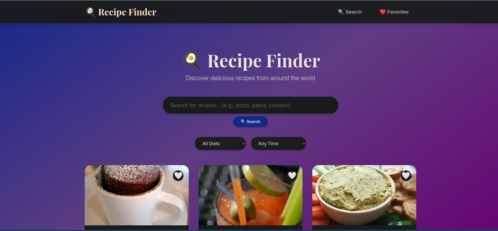
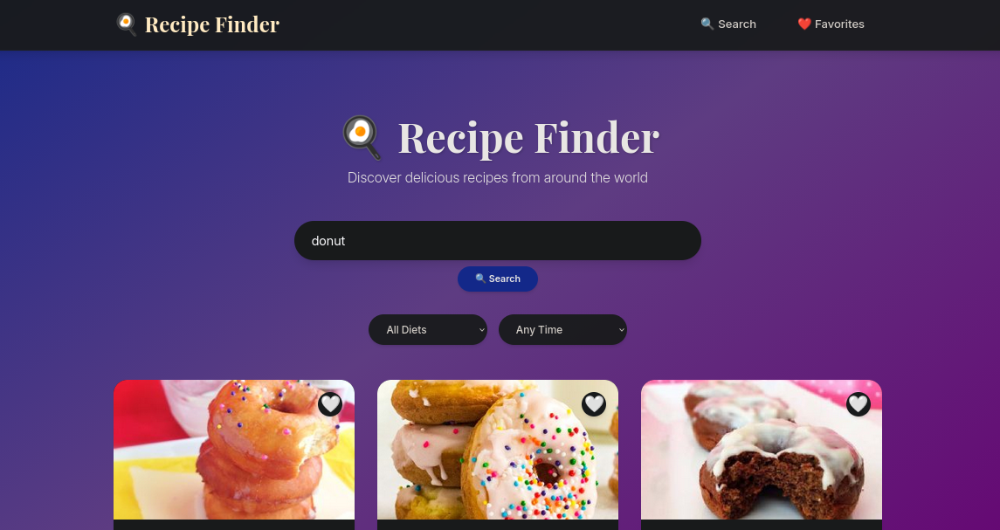
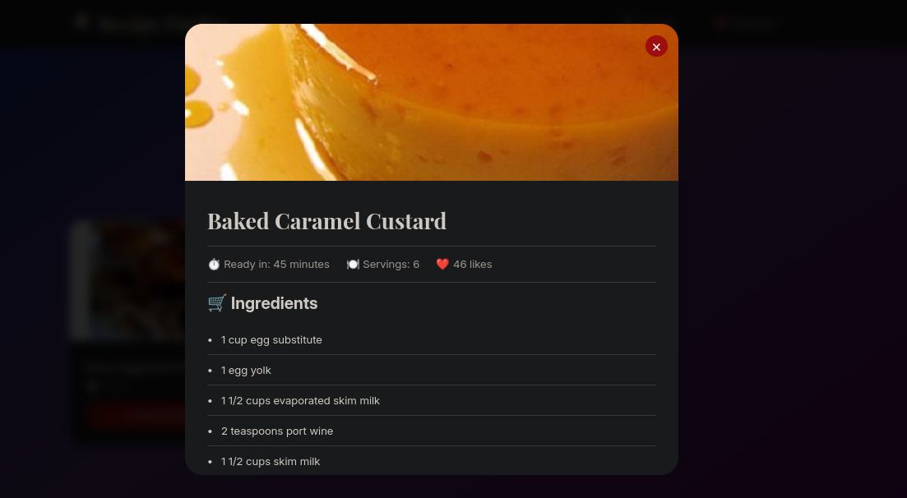
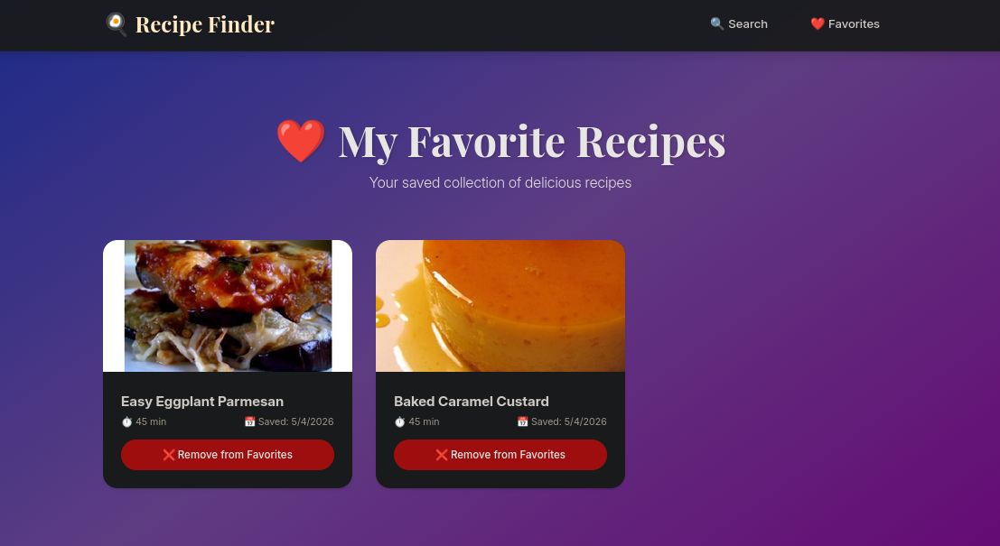

# 🍳 Recipe Finder

A full-stack recipe discovery web application that allows users to search for recipes, apply dietary filters, save favorites, and view detailed cooking instructions. Built with modern web technologies and clean software engineering practices.

---

## 📌 Table of Contents

- [Overview](#-overview)
- [Features](#-features)
- [Tech Stack](#-tech-stack)
- [Architecture](#-architecture)
- [Installation](#-installation)
- [Configuration](#-configuration)
- [Running the Application](#-running-the-application)
- [API Endpoints](#-api-endpoints)
- [Database Schema](#-database-schema)
- [Project Structure](#-project-structure)
- [Screenshots](#-screenshots)
- [Troubleshooting](#-troubleshooting)
- [Future Enhancements](#-future-enhancements)
- [Author](#-author)
- [License](#-license)

---

## 📖 Overview

**Recipe Finder** helps users discover recipes from around the world with powerful search and filtering capabilities.

- 🔍 Search recipes by name, ingredients, or cuisine
- 🥗 Apply dietary filters
- ❤️ Save favorite recipes
- 📖 View detailed instructions and nutrition

**Course Project:** Software Engineering
**Duration:** 4 Weeks

---

## ✨ Features

### ✅ Implemented

- 🔍 Recipe search (name, ingredients, cuisine)
- 🥗 Dietary filters (vegetarian, vegan, gluten-free)
- 📖 Recipe details (ingredients, instructions, nutrition)
- ❤️ Favorites system (save/remove recipes)
- 📱 Fully responsive UI
- 🚀 API rate limiting
- 💾 In-memory caching
- 🎨 Modern animated UI

### 🚧 Planned

- User authentication (JWT)
- Recipe recommendations
- Meal planner
- Shopping list generator
- Dark mode

---

## 📐 Development Methodology

This project follows the Incremental Model, where the application is built and delivered in small, functional stages. Each increment adds new features while keeping the system stable and testable.

## 🚀 Why Incremental Model?

Early Working Version – A basic prototype was available from the first week
Easier Debugging – Issues were identified and fixed increment by increment
Continuous Improvement – Features were refined based on testing
Better Time Management – Core features were prioritized first

## 📦 Development Increments

Increment Focus Key Deliverables

1. Foundation UI Setup React UI, mock data, search functionality
2. API Integration Backend Express server, real recipe data, details view
3. Persistence Database SQLite setup, favorites system (CRUD)
4. Polish UX & Deployment Filters, responsive design, final improvements
   🧪 Testing Approach

Each increment was tested before moving forward:

##### Increment 1: Component testing (UI & search)

##### Increment 2: API and integration testing

##### Increment 4: End-to-end system testing

## 📈 Key Benefits

##### ✔️ Working software delivered early

##### ✔️ Reduced risk through continuous testing

##### ✔️ Clear weekly progress and milestones

##### ✔️ Flexible and adaptable development process

## 🧠 Summary

The Incremental Model allowed this project to be developed in a structured and reliable way, ensuring steady progress, fewer bugs, and a fully functional final product.

## 🛠️ Tech Stack

### Frontend

- React (18)
- Vite
- React Router
- Axios
- CSS3

### Backend

- Node.js
- Express.js
- SQLite3
- Axios

### External API

- Spoonacular API

---

## 🏗️ Architecture

```
Client (React)
   │
   │ HTTP/JSON
   ▼
Backend (Express)
   ├── Controllers
   ├── Routes
   ├── Services
   ├── Middleware
   └── Models
   │
   ├── SQLite Database
   └── Spoonacular API
```

### Data Flow

1. User searches recipe
2. Frontend → Backend API
3. Backend → Cache / External API
4. Response returned → UI updated
5. Favorites stored in SQLite

---

## 💻 Installation

### Prerequisites

- Node.js (v18+)
- npm (v9+)
- Git

Check versions:

```bash
node --version
npm --version
git --version
```

---

### 1️⃣ Clone Repository

```bash
git clone https://github.com/Parvez152977/Recipe_finder.git
cd Recipe_finder
```

---

### 2️⃣ Backend Setup

```bash
cd backend
npm install

# Create environment file
cp .env.example .env 2>/dev/null || touch .env
```

---

### 3️⃣ Frontend Setup

```bash
cd ..
cd frontend/
npm install
cd ..
```

---

## ⚙️ Configuration

### Environment Variables

#### Backend (`backend/.env`)

```env
PORT=5000
API_KEY=your_spoonacular_api_key
API_URL=https://api.spoonacular.com
```

#### Frontend (`frontend/.env`) _(optional)_

```env
VITE_API_URL=http://localhost:5000/api
```

⚠️ Never commit `.env` files.

---

## ▶️ Running the Application

### Development Mode (Recommended)

#### Start Backend

```bash
cd backend
npm run dev
```

#### Start Frontend

```bash
cd frontend
npm run dev
```

Frontend: http://localhost:5173
Backend: http://localhost:5000

---

### Production Mode

```bash
cd frontend
npm run build

cd ../backend
npm start
```

---

## 🧪 Testing

### API Testing

```bash
# Health check
curl http://localhost:5000/health

# Search recipes
curl "http://localhost:5000/api/recipes/search?query=pizza"

# Recipe details
curl http://localhost:5000/api/recipes/716429
```

---

## 📡 API Endpoints

### Recipes

| Method | Endpoint              | Description    |
| ------ | --------------------- | -------------- |
| GET    | `/api/recipes/search` | Search recipes |
| GET    | `/api/recipes/random` | Random recipes |
| GET    | `/api/recipes/:id`    | Recipe details |
| GET    | `/health`             | Server health  |

### Favorites

| Method | Endpoint                                 | Description     |
| ------ | ---------------------------------------- | --------------- |
| GET    | `/api/favorites/:userId`                 | Get favorites   |
| POST   | `/api/favorites`                         | Add favorite    |
| DELETE | `/api/favorites/:userId/:recipeId`       | Remove favorite |
| GET    | `/api/favorites/check/:userId/:recipeId` | Check favorite  |

---

## 🗄️ Database Schema

### Users Table

```sql
CREATE TABLE users (
  id INTEGER PRIMARY KEY AUTOINCREMENT,
  name TEXT,
  created_at DATETIME DEFAULT CURRENT_TIMESTAMP
);
```

### Favorites Table

```sql
CREATE TABLE favorites (
  id INTEGER PRIMARY KEY AUTOINCREMENT,
  user_id INTEGER,
  recipe_id TEXT,
  recipe_title TEXT,
  recipe_image TEXT,
  ready_in_minutes INTEGER,
  saved_at DATETIME DEFAULT CURRENT_TIMESTAMP,
  FOREIGN KEY(user_id) REFERENCES users(id),
  UNIQUE(user_id, recipe_id)
);
```

---

## 📁 Project Structure

```
Recipe_finder/
├── backend/
│   ├── controllers/
│   ├── routes/
│   ├── services/
│   ├── middleware/
│   ├── models/
│   ├── app.js
│   ├── server.js
│   └── recipes.db
│
├── frontend/
│   ├── src/
│   ├── public/
│   └── package.json
│
├── README.md
└── .gitignore
```

---

## 📸 Screenshots

| Feature        | Preview                                                      |
| -------------- | ------------------------------------------------------------ |
| Home Page      |       |
| Search Results |  |
| Recipe Details |  |
| Favorites      |       |

---

## 🔧 Troubleshooting

| Issue                   | Solution                        |
| ----------------------- | ------------------------------- |
| Backend not starting    | Check port 5000 availability    |
| API key error           | Verify `.env` configuration     |
| 429 error               | Wait or reduce API calls        |
| Frontend not connecting | Ensure backend is running       |
| DB issues               | Delete `recipes.db` and restart |

---

## 👨‍💻 Author

**Parvez Alam**

- GitHub: https://github.com/Parvez152977
- Project: Recipe Finder

---

## ⭐ Support

If you found this helpful, consider giving it a ⭐ on GitHub.

---

🍳 Happy Cooking!
